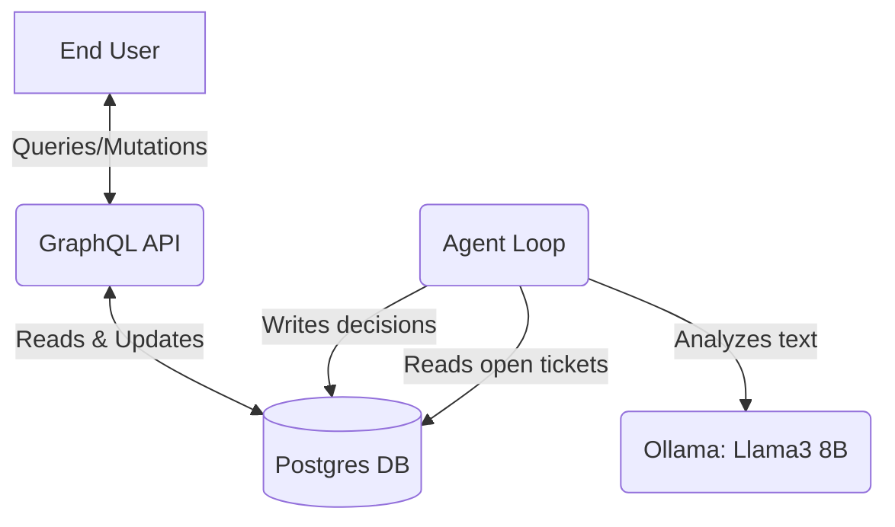

# TicketPilot

TicketPilot is an autonomous, local-first support-ticket triage agent written in Go.

## Problem Statement

A large volume of support tickets can slow down human agents, especially when a good proportion are duplicates, spam, or routine inquiries that could be triaged automatically. TicketPilot identifies high-risk tickets for escalation, auto-closes spam/duplicates, and drafts responses for general inquiries using a local, privacy-preserving LLM (Ollama).

## Architecture



- **Language**: Go 1.22+
- **API**: GraphQL via `gqlgen`
- **DB**: Postgres 15 via `pgx` (Running in Docker)
- **Local LLM**: Ollama natively installed on host (Windows, macOS, or Linux)

## How to Run

1. Make sure you have Ollama installed natively on your host machine (download from [ollama.com](https://ollama.com) or use your package manager), and start it. Ensure it comes with a capable model (like `llama3:latest`):
   ```bash
   ollama serve
   ollama pull llama3:latest
   ```

2. Start the database and backend services using Docker Compose:
   ```bash
   docker compose up --build
   ```

3. Initialize the database and get metrics:
   You can run the seed and metrics binaries to simulate evaluation:

   ```bash
   # In a separate terminal
   go run cmd/seed/main.go
   
   # Let the agent background service process the tickets (wait a minute or two)
   
   go run cmd/metrics/main.go
   ```

## Sample GraphQL Queries

Endpoint: `http://localhost:8080/query`

**Fetch Open Tickets:**
```graphql
query {
  tickets(status: "open") {
    id
    subject
    status
    category
    riskScore
  }
}
```

**Fetch Decisions for a Ticket:**
```graphql
query {
  decisions(ticketId: "1") {
    action
    confidence
    reasoning
  }
}
```

**Override a Decision:**
```graphql
mutation {
  overrideDecision(ticketId: "1", newAction: "escalate") {
    action
    overriddenByHuman
  }
}
```

## Metrics Output (Evaluated over 20 hand-labeled tickets)

**Diagnosing and Fixing Low Escalate Recall.** The initial evaluation showed low recall (14.29%) on the escalate action. Auditing the decisions table showed the LLM was correctly scoring legitimate escalations as high-risk (risk_score: 80), but the policy required risk_score > 80 to trigger — so tickets scored exactly at the boundary were falling just short of the cutoff. Lowering the threshold to > 75 fixed this without hurting precision:

```text
Evaluated 20 labeled tickets.
Overall Accuracy: 85.00%

Action 'respond':
  Precision: 70.00%
  Recall:    100.00%

Action 'escalate':
  Precision: 100.00%
  Recall:    85.71%

Action 'close':
  Precision: 100.00%
  Recall:    66.67%
```
